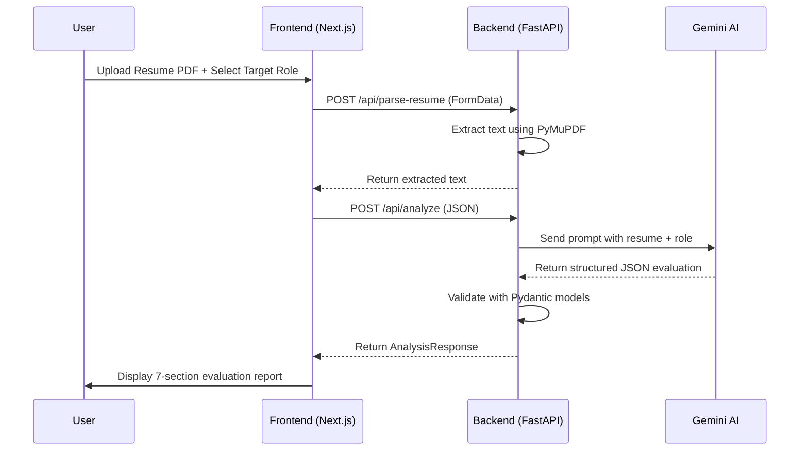
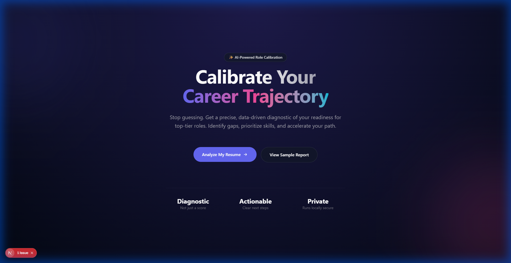
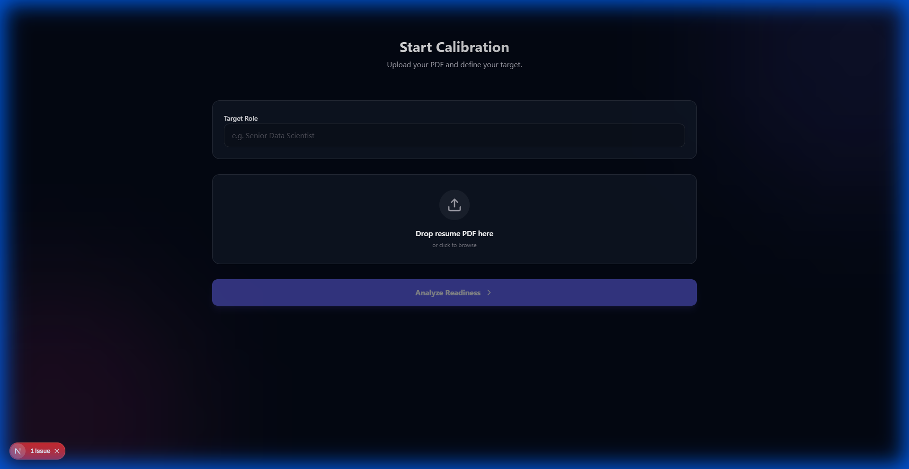

# 🎯 Career Intelligence Platform

<div align="center">


**An AI-Powered Resume Intelligence and Career Guidance System**

*Helping early-career professionals calibrate their readiness for target roles with diagnostic clarity and actionable guidance.*

[Features](#-features) • [Architecture](#-system-architecture) • [Installation](#-installation) • [Usage](#-usage) • [API Reference](#-api-reference) • [Screenshots](#-screenshots)

</div>

---

## 📋 Table of Contents

- [Abstract](#-abstract)
- [Problem Statement](#-problem-statement)
- [Objectives](#-objectives)
- [Features](#-features)
- [System Architecture](#-system-architecture)
- [Technology Stack](#-technology-stack)
- [Installation](#-installation)
- [Usage](#-usage)
- [API Reference](#-api-reference)
- [Data Models](#-data-models)
- [AI Engine](#-ai-engine)
- [Screenshots](#-screenshots)
- [Future Enhancements](#-future-enhancements)
- [Contributors](#-contributors)
- [License](#-license)

---

## 📄 Abstract

The **Career Intelligence Platform** is an AI-driven web application designed to revolutionize how early-career professionals and final-year students evaluate their job readiness. Unlike traditional resume scoring tools that provide opaque, single-number ratings, this platform delivers **comprehensive diagnostic evaluations** that treat a resume as a semantic representation of a candidate's skills, experience, and career trajectory.

The system leverages **Google's Gemini 2.5 Flash** large language model integrated via LangChain to perform deep resume analysis against industry-standard role expectations. It provides:

- **Multi-dimensional skill breakdown** with evidence-based scoring
- **Gap analysis** with severity classification
- **Personalized action plans** for improvement
- **Resume-level recommendations** for optimization
- **Final hiring verdict** with clear next steps

The platform answers two fundamental questions every job seeker has:
1. *"Which roles am I realistically ready for right now?"*
2. *"What exactly is blocking me from my target role, and what should I work on next?"*

---

## ❓ Problem Statement

Early-career professionals and recent graduates face significant challenges in the job market:

| Challenge | Impact |
|-----------|--------|
| **Lack of Calibration** | High ambition but low understanding of where they actually stand |
| **Generic Feedback** | Resume review tools provide vague, non-actionable advice |
| **Opaque Scoring** | Black-box ATS scores without explanation create anxiety |
| **Information Overload** | Too many skills to learn, no clear prioritization |
| **Limited Access** | Industry-quality feedback is expensive or unavailable |
| **Prestige Bias** | Traditional tools favor brand names over actual skills |

### The Gap

Existing solutions fail to provide **calibration over aspiration** — they don't help users understand where they stand *today* and how to move forward with focus and confidence.

---

## 🎯 Objectives

### Primary Objectives

1. **Role Readiness Assessment** — Provide fair, explainable evaluation of candidate fit for target roles
2. **Gap Identification** — Pinpoint precise, role-specific blockers with severity classification
3. **Actionable Guidance** — Translate diagnosis into a prioritized, achievable improvement plan
4. **Confidence Building** — Build user confidence through clarity, not false optimism or rejection

### Technical Objectives

1. Implement a **microservices architecture** with decoupled frontend and backend
2. Integrate **advanced LLM capabilities** for natural language understanding
3. Build a **responsive, accessible UI** with modern design principles
4. Ensure **type-safe data flow** between frontend and backend
5. Create **extensible data models** for comprehensive evaluation reports

---

## ✨ Features

### Core Features

| Feature | Description |
|---------|-------------|
| 📄 **PDF Resume Parsing** | Extract text from uploaded PDF resumes using PyMuPDF |
| 🎯 **Target Role Selection** | Users specify their desired role for tailored evaluation |
| 📊 **7-Dimension Skill Breakdown** | Comprehensive scoring across core competency areas |
| 🔍 **Gap Detection** | Identify missing skills with severity ratings (Low/Medium/High) |
| 📋 **Action Plan Generation** | Concrete project-based recommendations for improvement |
| 📝 **Resume Recommendations** | Specific coaching feedback for resume optimization |
| ⚖️ **Hiring Verdict** | Clear assessment of job readiness with next steps |

### Technical Features

- ⚡ **Fast API Backend** — High-performance REST API with automatic documentation
- 🔄 **Real-time Analysis** — Streaming analysis with progress indicators
- 🎨 **Modern UI/UX** — Glassmorphism design with smooth animations
- 📱 **Responsive Design** — Works across desktop and mobile devices
- 🔒 **Type Safety** — Full TypeScript frontend with Pydantic backend validation
- 🔁 **Retry Logic** — Intelligent retry mechanism for API rate limits

---

## 🏗 System Architecture

```
┌─────────────────────────────────────────────────────────────────────────┐
│                              USER INTERFACE                              │
│                         (Next.js 16 + React 19)                          │
│  ┌─────────────┐  ┌──────────────┐  ┌─────────────────────────────────┐  │
│  │  Home Page  │  │ Analysis Flow│  │       Result Dashboard          │  │
│  │   (Hero)    │→ │ (File Upload)│→ │  (7-Section Evaluation Report)  │  │
│  └─────────────┘  └──────────────┘  └─────────────────────────────────┘  │
└───────────────────────────────┬─────────────────────────────────────────┘
                                │ HTTP REST API
                                ▼
┌─────────────────────────────────────────────────────────────────────────┐
│                            BACKEND SERVER                                │
│                         (FastAPI + Python 3.10)                          │
│  ┌─────────────────┐  ┌─────────────────┐  ┌─────────────────────────┐  │
│  │   Main Router   │  │  Resume Parser  │  │      AI Engine          │  │
│  │  (Endpoints)    │→ │   (PyMuPDF)     │→ │  (LangChain + Gemini)   │  │
│  └─────────────────┘  └─────────────────┘  └─────────────────────────┘  │
│                                                       │                  │
│  ┌─────────────────────────────────────────────────────────────────┐    │
│  │                    Pydantic Data Models                          │    │
│  │  (AnalysisRequest, AnalysisResponse, SkillBreakdown, etc.)      │    │
│  └─────────────────────────────────────────────────────────────────┘    │
└───────────────────────────────┬─────────────────────────────────────────┘
                                │ API Call
                                ▼
┌─────────────────────────────────────────────────────────────────────────┐
│                        EXTERNAL AI SERVICE                               │
│                      (Google Gemini 2.5 Flash)                           │
│         Prompt Engineering → JSON Structured Output → Validation         │
└─────────────────────────────────────────────────────────────────────────┘
```

### Data Flow



---

## 🛠 Technology Stack

### Frontend

| Technology | Version | Purpose |
|------------|---------|---------|
| **Next.js** | 16.0.10 | React framework with App Router |
| **React** | 19.2.1 | UI component library |
| **TypeScript** | 5.x | Type-safe JavaScript |
| **Tailwind CSS** | 4.x | Utility-first CSS framework |
| **Framer Motion** | 12.x | Animation library |
| **Lucide React** | 0.561.0 | Icon library |

### Backend

| Technology | Version | Purpose |
|------------|---------|---------|
| **Python** | 3.10+ | Core programming language |
| **FastAPI** | 0.100+ | High-performance API framework |
| **Pydantic** | 2.0+ | Data validation & serialization |
| **LangChain** | Latest | LLM orchestration framework |
| **LangChain-Google-GenAI** | Latest | Gemini integration |
| **PyMuPDF (fitz)** | Latest | PDF text extraction |
| **Uvicorn** | 0.23+ | ASGI server |
| **python-dotenv** | Latest | Environment variable management |

### AI/ML

| Technology | Purpose |
|------------|---------|
| **Google Gemini 2.5 Flash** | Large language model for analysis |
| **Prompt Engineering** | Structured output generation |
| **JSON Output Parser** | Type-safe LLM response parsing |

---

## 📦 Installation

### Prerequisites

- **Python 3.10+** installed
- **Node.js 18+** and npm installed
- **Google API Key** for Gemini AI

### Step 1: Clone the Repository

```bash
git clone https://github.com/yourusername/career-intelligence-platform.git
cd career-intelligence-platform
```

### Step 2: Backend Setup

```bash
# Navigate to backend directory
cd backend

# Create virtual environment (recommended)
python -m venv venv

# Activate virtual environment
# On Windows:
.\venv\Scripts\activate
# On macOS/Linux:
source venv/bin/activate

# Install dependencies
pip install -r requirements.txt

# Create environment file
echo "GOOGLE_API_KEY=your_api_key_here" > .env
```

### Step 3: Frontend Setup

```bash
# Navigate to frontend directory
cd ../frontend

# Install dependencies
npm install
```

### Step 4: Start the Application

**Terminal 1 - Backend:**
```bash
# From project root
uvicorn backend.main:app --reload --port 8000
```

**Terminal 2 - Frontend:**
```bash
# From frontend directory
cd frontend
npm run dev
```

### Step 5: Access the Application

- **Frontend**: http://localhost:3000
- **Backend API Docs**: http://localhost:8000/docs
- **Backend ReDoc**: http://localhost:8000/redoc

---

## 🚀 Usage

### Step 1: Access the Platform

Navigate to `http://localhost:3000` in your browser.

### Step 2: Start Analysis

Click the **"Analyze My Resume"** button on the home page.

### Step 3: Provide Inputs

1. **Enter Target Role**: Specify the job title you're targeting (e.g., "Machine Learning Engineer", "Senior Data Scientist")
2. **Upload Resume**: Drag and drop or click to upload your PDF resume

### Step 4: Review Results

The platform generates a comprehensive 7-section evaluation report:

| Section | Description |
|---------|-------------|
| 🎯 **Overall Fit** | Score (0-100) and fit category with summary |
| 📊 **Skill Breakdown** | 7 competency areas scored 0-10 with justifications |
| ✅ **Demonstrated Work** | Verified accomplishments from your resume |
| ⚠️ **Detected Gaps** | Missing skills with severity and impact |
| 💡 **Action Plan** | Specific projects to build for each gap |
| 📝 **Resume Recommendations** | Coaching feedback for resume bullets |
| ⚖️ **Hiring Verdict** | Final assessment and recommendation |

---

## 📡 API Reference

### Base URL
```
http://localhost:8000
```

### Endpoints

#### `GET /health`
Health check endpoint.

**Response:**
```json
{
  "status": "ok",
  "service": "career-intelligence-backend"
}
```

---

#### `POST /api/parse-resume`
Extract text from a PDF resume.

**Request:**
- Content-Type: `multipart/form-data`
- Body: `file` (PDF file)

**Response:**
```json
{
  "filename": "resume.pdf",
  "text": "Extracted resume text content..."
}
```

---

#### `POST /api/analyze`
Analyze resume against a target role.

**Request:**
```json
{
  "resume_text": "Full text content of resume...",
  "target_role": {
    "role_title": "Machine Learning Engineer",
    "description": "Optional role description",
    "level": "Entry-Level"
  }
}
```

**Response:** See [Data Models](#-data-models) for full `AnalysisResponse` schema.

---

## 📊 Data Models

### Input Models

```python
class RoleTarget(BaseModel):
    role_title: str
    description: Optional[str] = None
    level: Optional[str] = "Entry-Level"

class AnalysisRequest(BaseModel):
    resume_text: str 
    target_role: RoleTarget
```

### Output Models

```python
class AnalysisResponse(BaseModel):
    overall_fit: OverallFitSummary       # Score & fit category
    skill_breakdown: SkillBreakdown       # 7 competency scores
    demonstrated_work: List[DemonstratedWork]  # Verified work
    detected_gaps: List[DetectedGap]      # Missing skills
    action_plan: List[ActionItem]         # Improvement steps
    resume_recommendations: List[ResumeRecommendation]  # Resume fixes
    hiring_verdict: HiringVerdict         # Final assessment
```

### Skill Breakdown Categories

| Category | Description |
|----------|-------------|
| `programming_software_engineering` | Coding skills, best practices, version control |
| `machine_learning_foundations` | ML theory, algorithms, mathematics |
| `applied_ml_ai_projects` | Hands-on ML/AI project experience |
| `mlops_cloud_readiness` | Deployment, cloud platforms, CI/CD |
| `data_engineering_sql` | Data pipelines, SQL, data modeling |
| `system_design_architecture` | Scalable system design knowledge |
| `communication_documentation` | Technical writing, presentation skills |

---

## 🤖 AI Engine

### Prompt Engineering

The AI engine uses a carefully crafted prompt that instructs Gemini to act as a **Senior AI/ML Hiring Manager**. Key aspects:

1. **Evaluation Rules**
   - Certifications ≠ applied skill
   - Listing tools ≠ mastery
   - Academic projects count only if depth is shown
   - No hallucinated experience

2. **Output Structure**
   - Strictly typed JSON matching Pydantic models
   - Evidence-based justifications required
   - Severity levels for gaps (Low/Medium/High)

3. **Retry Logic**
   - Automatic retry on rate limits (429 errors)
   - Exponential backoff strategy
   - Maximum 3 retry attempts

### LangChain Integration

```python
from langchain_google_genai import ChatGoogleGenerativeAI
from langchain_core.prompts import ChatPromptTemplate
from langchain_core.output_parsers import JsonOutputParser

llm = ChatGoogleGenerativeAI(model="gemini-2.5-flash", temperature=0.1)
parser = JsonOutputParser(pydantic_object=AnalysisResponse)
chain = prompt | llm | parser
```

---

## 📸 Screenshots

### Home Page
The landing page features a modern glassmorphism design with animated backgrounds, clear value proposition, and call-to-action buttons.



### Analysis Flow
Users can upload their resume and select a target role through an intuitive drag-and-drop interface with real-time validation.



### Results Dashboard
The comprehensive 7-section report displays skill scores with progress bars, gap severity indicators, and actionable improvement plans.

*Note: Run an analysis to see the full results dashboard with your personalized evaluation.*

---

## 🔮 Future Enhancements

| Enhancement | Description | Priority |
|-------------|-------------|----------|
| **Longitudinal Tracking** | Track readiness progression over time | High |
| **Dynamic Benchmarks** | Update role expectations based on market data | High |
| **Portfolio Integration** | Parse GitHub/LinkedIn for additional signals | Medium |
| **Multiple Role Comparison** | Compare readiness across different roles | Medium |
| **Resume Builder** | Generate optimized resume based on feedback | Low |
| **Learning Path Integration** | Connect to Coursera/Udemy for skill building | Low |

---

## 👥 Contributors

| Name | Role | GitHub |
|------|------|--------|
| Kumar Vaishnav | Project Lead & Developer | [@Kumarvaishnav](https://github.com/Kumarvaishnav) |

---

## 📄 License

This project is licensed under the MIT License - see the [LICENSE](LICENSE) file for details.

---

## 🙏 Acknowledgments

- **Google DeepMind** — For the Gemini AI model
- **LangChain** — For the excellent LLM framework
- **Vercel** — For Next.js and React frameworks
- **FastAPI** — For the high-performance Python web framework

---

<div align="center">

**Made with ❤️ for Career Development**

*"Calibration over Aspiration — Know where you stand, focus where it matters."*

</div>
